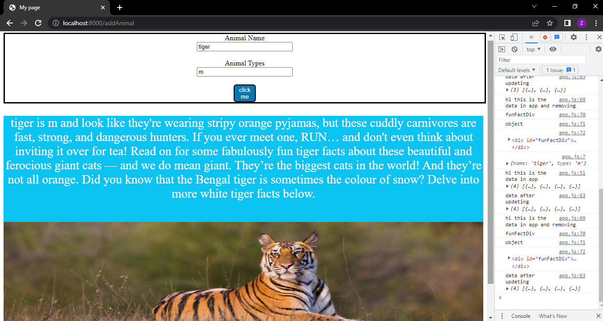

# Hi there this is my firs project using Node.js and javascript and html and css, when the user enter the name of an animal (tigers only) and then click the button it will display an image of the animal and fun fact about it and so on.
 

[server.js file](Fun-Fact-About-Tigers-project/server.js)
[css file](Fun-Fact-About-Tigers-project/demo/styles.css)
[app.js file](Fun-Fact-About-Tigers-project/demo/app.js)
[html file](Fun-Fact-About-Tigers-project/demo/index.html)

my video on Youtube:
https://youtu.be/-siXOCSn5_8
